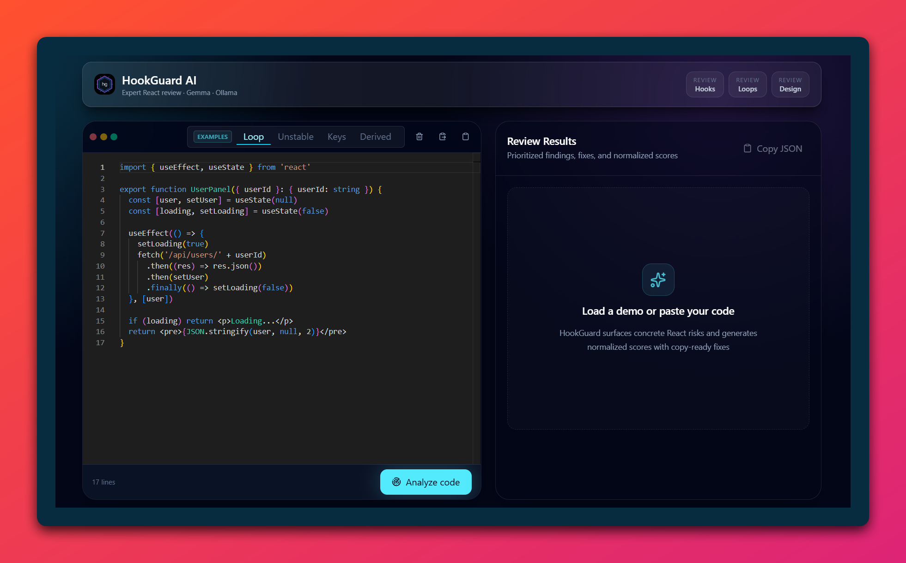
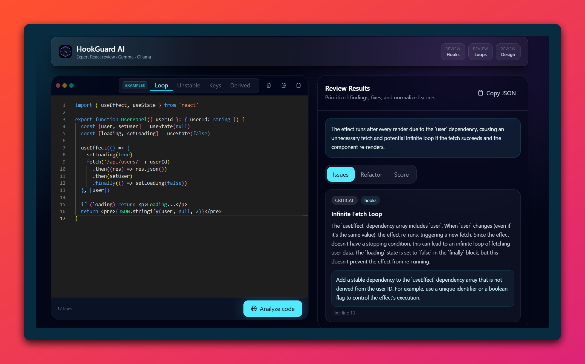
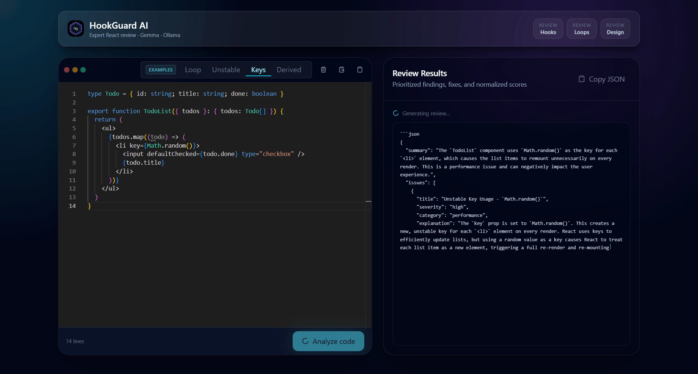

# HookGuard AI

**Local React code reviewer powered by Gemma**

HookGuard AI analyses React components for hook bugs, infinite loops, unstable dependencies, and architecture smells — all running on your machine with no cloud, no API keys, and no data leaving your computer.

**[🔗 Live demo — hookguard-ai.vercel.app](https://hookguard-ai.vercel.app)** · No installation needed · Runs on prerecorded examples

**[▶️ Video walkthrough](https://youtu.be/YOUR_VIDEO_ID)** · 2 min demo

---

## Screenshots


| Editor | Review results |
|--------|----------------|
|  |  |

---

## Features

- **React hook analysis** — detects missing deps, stale closures, effects with no cleanup, and derived state stored unnecessarily in state
- **Infinite loop detection** — distinguishes real self-triggering loops from harmless rerenders with precision calibrated by an automated eval suite
- **Dependency stability analysis** — catches object, array, and function literals used as effect dependencies that recreate a new reference on every render
- **Refactor suggestions** — returns minimal, copy-ready TypeScript fixes for every finding, validated internally before being shown
- **AST-backed analysis** — uses `@babel/parser` to extract exact dependency arrays and state variable pairs before sending code to the model, reducing hallucinations
- **Local AI with Ollama + Gemma** — zero cloud calls, zero API costs, full privacy
- **Streaming responses** — tokens stream from Ollama to the UI in real time via SSE, so you see the model thinking before results are parsed
- **SHA-256 result cache** — identical snippets return instantly without re-running the model
- **Automated eval system** — 10 regression cases covering loops, false positives, stale closures, derived state, and unstable callbacks

---

## Tech Stack

| Layer | Technology |
|-------|------------|
| Frontend | React 19, Vite, TypeScript, TailwindCSS, Monaco Editor |
| Backend | Fastify, TypeScript, Zod |
| AI runtime | Ollama, Gemma 3 4B |
| Code analysis | `@babel/parser` (AST), regex heuristics |
| Transport | Server-Sent Events (SSE) streaming |
| Quality | 10-case eval suite, ESLint, Prettier |

---

## Requirements

- Node.js 20+
- [Ollama](https://ollama.com) running locally
- Gemma pulled: `ollama pull gemma3:4b`

---

## Quick Start

One-time setup:

```bash
git clone https://github.com/Arrayo/hookguard-ai.git
cd hookguard-ai
cp backend/.env.example backend/.env
ollama pull gemma3:4b
npm install
npm install --prefix backend
npm install --prefix frontend
```

Run the app with two terminals:

```bash
# Terminal 1
ollama serve

# Terminal 2, from the project root
npm run dev
```

Open **http://localhost:5173** and paste any React component.


---

## Running Services

Keep Ollama running in one terminal:

```bash
ollama serve
```

Then run backend and frontend together from the project root:

```bash
npm run dev
```

Or run backend and frontend separately:

```bash
npm run dev --prefix backend   # http://localhost:3333
npm run dev --prefix frontend  # http://localhost:5173
```

Health check: `http://localhost:3333/health`

---

## Environment Variables

Copy `backend/.env.example` and adjust if your Ollama setup differs:

```bash
PORT=3333
HOST=0.0.0.0
FRONTEND_ORIGIN=http://localhost:5173
OLLAMA_HOST=http://127.0.0.1:11434
OLLAMA_MODEL=gemma3:4b
```

Change `OLLAMA_MODEL` to any Gemma tag you have pulled locally.

---

## Demo Examples

The app ships four built-in examples covering the most common React anti-patterns:

| Example | What it shows |
|---------|---------------|
| **Loop** | Effect updates its own dependency (`[user]`) causing a fetch storm |
| **Unstable** | Object literal `{ query, limit: 20 }` recreated every render and used as `[filters]` |
| **Keys** | `key={Math.random()}` remounts list items on every render |
| **Derived** | State stored in `useEffect` that could simply be computed during render |

>
> 

---

## Architecture

HookGuard AI follows a lightweight hexagonal shape — no enterprise overhead.

```
hookguard-ai/
├── frontend/
│   └── src/
│       ├── features/review/        # Domain feature: components, hook, API, utils
│       │   ├── components/         # CodeEditorPanel, ReviewPanels, LoadingState…
│       │   ├── useReviewAnalysis.ts # State + streaming orchestration
│       │   ├── api.ts              # SSE stream client
│       │   └── demoExamples.ts     # Built-in snippets
│       └── hooks/
│           └── useCopyFeedback.ts  # Reusable clipboard hook
│
└── backend/
    └── src/
        ├── domain/                 # Types and port contracts
        ├── application/            # Use cases (analyzeReactCode)
        ├── infrastructure/
        │   ├── ollama/             # Adapter: systemPrompt, codeFactsBuilder, aiResponseParser
        │   └── ast/                # reactHooksAnalyzer (@babel/parser)
        └── interfaces/http/        # Fastify routes, schemas, error handler
```

**Review pipeline:**

```
Browser → POST /api/reviews/react/stream
       → AST analysis (babel) + regex code facts
       → Ollama chat (Gemma, streaming)
       → SSE tokens → browser
       → JSON parse + normalize + score cap
       → Structured ReviewResponse
```

The backend never calls external APIs. Everything resolves through `localhost:11434` (Ollama).

---

## Evaluation System

HookGuard AI ships a regression eval suite that sends real React snippets to the live API and validates the model's response against expected behaviour.

```bash
# Run all 10 cases
npm run evals

# Run a single case
npm run evals -- --case 01
```

### What is validated per case

- Correct severity (`critical`, `high`, `medium`, `low`, or `none` for false-positive checks)
- Correct issue category (`hooks`, `performance`, `maintainability`…)
- Required keywords present in the review text
- Forbidden keywords absent (e.g. `"remove the dependency array"` is never valid advice)
- Score ranges per category (e.g. `hooks` score must be `< 75` for an unstable dep)
- No fallback parser usage (model must return clean JSON)

### Cases covered

| # | Snippet | Type |
|---|---------|------|
| 01 | Self-triggering effect `setCount(count + 1)` | Real infinite loop |
| 02 | Object literal `{ query, limit }` as `[filters]` | Unstable dependency |
| 03 | Render-only component with no hooks | Harmless — false positive check |
| 04 | `useEffect` storing `firstName + lastName` in state | Derived state |
| 05 | `key={Math.random()}` on list items | Random keys |
| 06 | `setSeconds(seconds + 1)` inside mount-only interval | Stale closure |
| 07 | `setActiveItems(items.filter(…))` in effect | Unnecessary effect |
| 08 | Effect with no dependency array calling `setWidth` | Loop — missing deps |
| 09 | `useEffect(() => setReady(true), [])` | Safe mount-only — false positive check |
| 10 | Inline `track` function in `[track]` dependency | Unstable callback |

The eval suite is what allows iterating on prompt engineering and AST heuristics with confidence — every change is regression-tested before shipping.

---

## Build & Lint

```bash
npm run build
npm run lint
npm run format:check
```

---

## License

MIT
